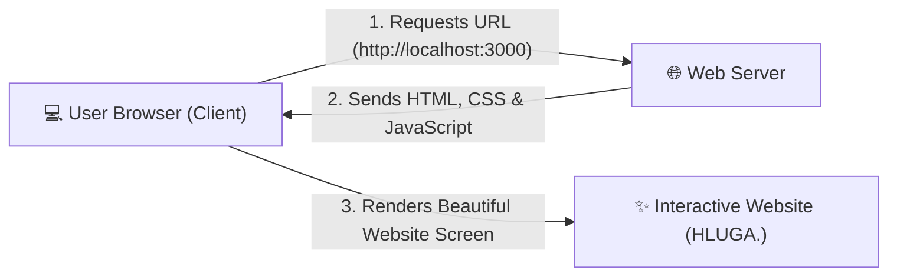
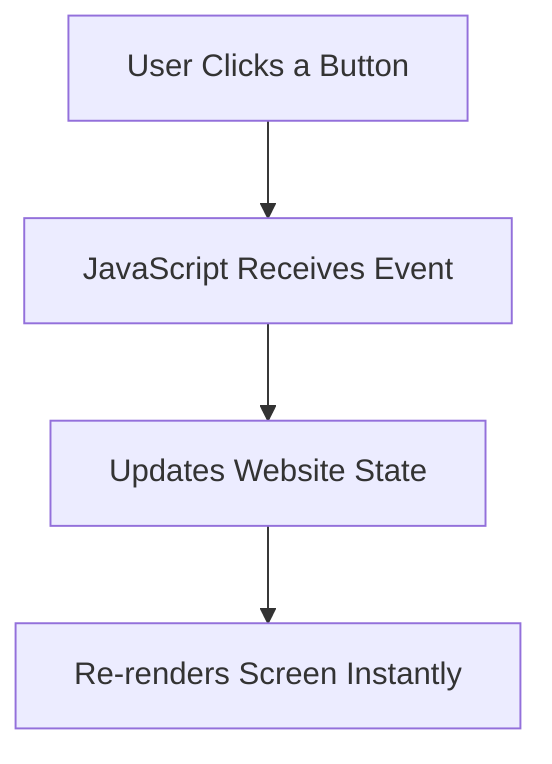
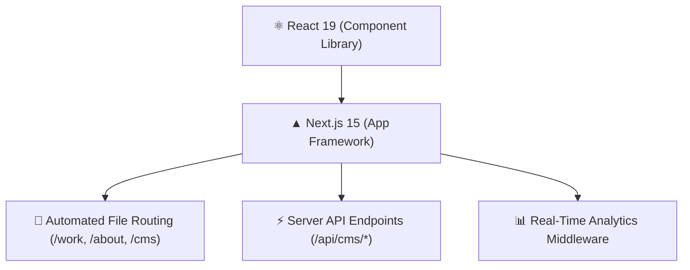

# 🎨 Chapter 1: Introduction & Web Coding Basics

Welcome to the **HLUGA. Website Learning Book**! This guide was written specifically for complete beginners who want to understand how a modern, professional web application is built from scratch.

> [!NOTE]
> **No Prior Coding Experience Required!**  
> Whether you have never written a line of code before or are just curious about web development, this book will guide you step-by-step with visual diagrams, colorful callouts, and real-world examples.

---

## 🌐 1. What is a Website?

At its core, a website is a set of files hosted on a computer (called a **Server**) that your web browser (like Chrome, Safari, or Edge) downloads and displays to you over the internet.



Modern websites are built using three core fundamental building blocks, plus a framework that ties them together:

```
+---------------------------------------------------------------------------------------+
|                                    YOUR WEBSITE                                       |
+--------------------------+---------------------------+--------------------------------+
|      🧱 HTML             |        🎨 CSS             |         ⚡ JAVASCRIPT          |
|   (The Skeleton)         |     (The Styling)         |         (The Brains)           |
|                          |                           |                                |
|  Headings, text, images, |  Colors, fonts, layout,   |  Clicks, animations, state,    |
|  buttons, links & structural |  spacing, dark mode & |  fetching data, CMS controls & |
|  elements                |  glassmorphic cards       |  real-time analytics           |
+--------------------------+---------------------------+--------------------------------+
```

---

## 🧱 2. The Three Web Core Pillars

### A. HTML (HyperText Markup Language) — The Skeleton
HTML provides the structural elements of your website. It uses **tags** enclosed in angle brackets `< >`.

```html
<!-- HTML Structural Examples -->
<h1>Lehlohonolo Mofokeng</h1>        <!-- Big Main Heading -->
<h2>Junior Frontend Developer</h2>     <!-- Subheading -->
<p>I build interactive web experiences.</p> <!-- Paragraph Text -->
<button>Contact Me</button>            <!-- Interactive Button -->
```

> [!TIP]
> Think of HTML as the bare concrete walls, doors, and windows of a house before any paint or furniture is added!

---

### B. CSS (Cascading Style Sheets) — The Clothes & Design
CSS makes your skeleton look stunning! It controls colors, background gradients, font sizes, margins, alignments, and responsive mobile screens.

```css
/* Example CSS Rule */
body {
  background-color: #0b0b0b;  /* 🖤 Deep dark background */
  color: #f4f1e8;             /* 🥛 Soft cream text */
  font-family: 'Inter', sans-serif;
}

.highlight-text {
  color: #75c5de;             /* 🧊 Signature Ice-Blue Accent */
  font-weight: bold;
}
```

> [!TIP]
> CSS is the interior design, paint, lighting, and furniture that turns a plain house into a luxury home!

---

### C. JavaScript (JS) & TypeScript (TS) — The Brains & Logic
JavaScript brings your website to life! When you click a menu button, switch color themes, submit a form, or trigger an animation, JavaScript executes that logic.

**TypeScript** is a typed version of JavaScript used in this project. It adds "types" to prevent errors (for instance, guaranteeing that a project count is a number, not text).



---

## 🚀 3. What Frameworks Are Used Here?

Instead of writing plain static HTML files by hand for every page, modern web engineering uses **React** and **Next.js 15**.



> [!IMPORTANT]
> **Why React & Next.js?**
> - **Reusable Components**: Build a button or navigation bar once and reuse it across 50 pages!
> - **Lightning Speed**: Pages load in under a second on mobile phones.
> - **Fullstack Capabilities**: Runs frontend pages and backend APIs in one unified codebase.

---

## 🧠 Key Terms Cheat Sheet

| Symbol | Term | What It Means in Simple Terms |
| :---: | :--- | :--- |
| 🧩 | **Component** | A reusable building block of UI (e.g., `<SiteNav />`, `<CtaButton />`). |
| 🏷️ | **Props** | Inputs passed into a component (e.g., giving a button the text `"Click Me"`). |
| 🔄 | **State** | Data inside a component that changes over time (e.g., dark mode ON/OFF). |
| 🌐 | **Route** | A page URL on your website (e.g., `/`, `/work`, `/about`, `/cms`). |
| 🎛️ | **CMS** | Content Management System — an admin platform to edit text and colors without writing code. |

---

> [!TIP]
> **Ready for Chapter 2?**  
> Head over to **[Chapter 2: Project Structure & Files](file:///c:/Users/Admin/OneDrive/Desktop/Hluga%27s%20site/to%20learn/02-project-structure-and-files.md)** to inspect how all files in this repository are organized!
