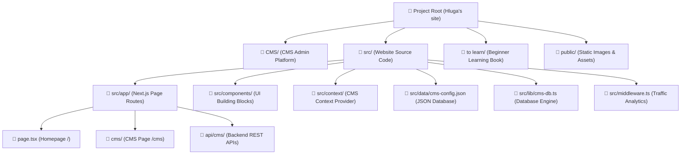

# 📁 Chapter 2: Project Structure & Directory Guide

In this chapter, we will explore the folder map of the entire codebase so you always know where every file lives and what role it plays!

> [!NOTE]
> **Don't Be Overwhelmed by the Files!**  
> Modern web projects have many files, but they follow a very logical pattern. Think of the project directory like a well-organized office filing cabinet.

---

## 🗺️ 1. Visual Architecture Map

Here is a high-level overview of how the key directories connect:



---

## 📂 2. Detailed Directory Structure

```
Hluga's site/
│
├── 🎛️ CMS/                          <-- Standalone CMS Platform Module
│   ├── 🧩 components/                <-- CMS UI Feature Tabs
│   │   ├── 📊 AnalyticsTab.tsx       <-- Traffic charts & visitor metrics
│   │   ├── 🖥️ CMSDashboard.tsx       <-- Master CMS layout & auth gate
│   │   ├── 🎨 ColorThemeTab.tsx      <-- Theme tuner & live site preview
│   │   ├── ✍️ ContentManagerTab.tsx  <-- Full CRUD editor (Profile, Projects, Services)
│   │   ├── 🚀 GitSyncTab.tsx         <-- One-click GitHub commit tool
│   │   └── 📑 SectionManagerTab.tsx  <-- Layout reordering & section toggles
│   ├── 🎨 cms.css                    <-- CMS design system stylesheet
│   ├── 📦 index.ts                   <-- Main CMS module export
│   └── 🏷️ types.ts                   <-- TypeScript data type definitions
│
├── 🌐 src/                          <-- Main Portfolio Website Source Code
│   ├── 🗺️ app/                       <-- Next.js Folder-Based Page Routes
│   │   ├── 👤 about/                 <-- About Page (/about)
│   │   ├── ⚡ api/cms/               <-- Backend REST API Suite (/api/cms/*)
│   │   ├── 🎛️ cms/                   <-- CMS Route (/cms)
│   │   ├── 📬 contact/               <-- Contact Page (/contact)
│   │   ├── 📅 experience/            <-- Career Timeline Page (/experience)
│   │   ├── 🛠️ services/              <-- Services Page (/services)
│   │   ├── 💼 work/                  <-- Portfolio Showcase (/work & /work/[slug])
│   │   ├── 📐 layout.tsx             <-- HTML Root Layout & Context Wrapper
│   │   └── 🏠 page.tsx               <-- Main Homepage (/)
│   │
│   ├── 🧩 components/                <-- Reusable Website UI Components
│   │   ├── 🌟 Hero.tsx               <-- Spotlight animated hero banner
│   │   ├── 🧭 SiteNav.tsx            <-- Navigation menu & mobile drawer
│   │   ├── 💼 WorkList.tsx           <-- Project showcase grid
│   │   └── 🦶 SiteFooter.tsx         <-- Contact callout & footer links
│   │
│   ├── 🔄 context/
│   │   └── CMSContext.tsx            <-- Real-time React context sharing CMS state
│   ├── 💾 data/
│   │   └── cms-config.json           <-- Single source of truth JSON database
│   ├── ⚙️ lib/
│   │   └── cms-db.ts                 <-- Server database engine & file storage
│   ├── 📊 middleware.ts              <-- Automatic real-time traffic tracking
│   └── 🎨 portfolio.css              <-- Main design system & CSS tokens
│
├── 📚 to learn/                      <-- Beginner Educational Learning Book
├── 🖼️ public/                        <-- Static images & icons
├── 📦 package.json                   <-- NPM package list & script commands
└── 📘 README.md                      <-- Root repository documentation
```

---

## 🔍 3. What Does Each Key Folder Do?

> [!IMPORTANT]
> **1. The `src/app/` Directory (Folder-Based Routing)**  
> In Next.js, every folder inside `src/app/` automatically becomes a page URL on your website!
> - `src/app/page.tsx` → Homepage (`https://yoursite.com/`)
> - `src/app/work/page.tsx` → Work Page (`https://yoursite.com/work`)
> - `src/app/cms/page.tsx` → CMS Admin Page (`https://yoursite.com/cms`)

> [!TIP]
> **2. The `src/components/` Directory (Reusable UI Blocks)**  
> This directory contains visual blocks that are assembled together to form pages:
> - `<Hero />`: The homepage intro banner with the spotlight mouse canvas effect.
> - `<SiteNav />`: The navigation bar at the top of the screen.
> - `<WorkList />`: The interactive grid displaying your portfolio projects.

> [!NOTE]
> **3. The `CMS/` Directory (Admin Management Platform)**  
> A dedicated module that houses the CMS admin interface. It connects to `/api/cms/*` so you can edit text, manage projects, tune colors, analyze traffic, and commit to GitHub without touching code.

---

> [!TIP]
> **Ready for Chapter 3?**  
> Jump to **[Chapter 3: Styling & Design System](file:///c:/Users/Admin/OneDrive/Desktop/Hluga%27s%20site/to%20learn/03-styling-and-design-system.md)** to see how colors, fonts, and design tokens work!
