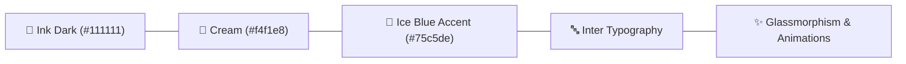
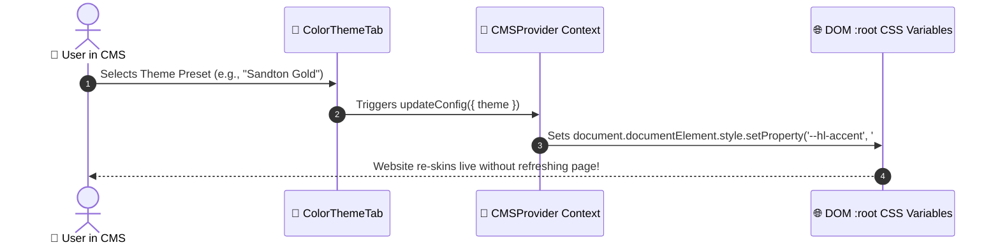

# 🎨 Chapter 3: Styling & Design System Guide

In this chapter, you will learn how the visual design system of HLUGA website works, how CSS variables control colors, and how you can tune the theme of your site!

---

## 🌈 1. The HLUGA Visual Aesthetic

HLUGA features a modern, editorial/brutalist design system designed to wow visitors instantly:



> [!IMPORTANT]
> **Key Design Principles Used:**
> - **High-Contrast Palette**: Sharp distinction between dark ink backgrounds and cream cards.
> - **Signature Accent**: Ice Blue (`#75c5de`) highlights key interactive elements like buttons and badges.
> - **Modern Typography**: Powered by the Google Font **Inter** for clean readability.
> - **Smooth Micro-Animations**: Reveal-on-scroll animations and interactive spotlight canvas effects.

---

## 🎨 2. What Are CSS Variables (Design Tokens)?

In CSS, **variables** (also called design tokens) store colors, font sizes, or spacing in one central location so they can be reused across the whole site.

The site's core variables are defined in **[src/portfolio.css](file:///c:/Users/Admin/OneDrive/Desktop/Hluga%27s%20site/src/portfolio.css)**:

```css
:root {
  --hl-page: #e4e4e4;      /* 🩶 Page Background */
  --hl-ink: #111111;       /* 🖤 Ink Dark Text & Headers */
  --hl-ink-deep: #0b0b0b;  /* ⬛ Deep Dark Accent Background */
  --hl-cream: #f4f1e8;     /* 🥛 Off-White Cream Cards */
  --hl-muted: #9a9590;     /* 👵 Muted Secondary Subtext */
  --hl-accent: #75c5de;    /* 🧊 Primary Highlight Color (Ice Blue) */
}
```

```
+-------------------------------------------------------------------------------+
|                             CSS VARIABLE FLOW                                 |
+-------------------------------------------------------------------------------+
|  Define in :root                Consume in Rules             Render on Screen |
|  --hl-accent: #75c5de;  ----->  background: var(--hl-accent); ----->  🧊 Button |
+-------------------------------------------------------------------------------+
```

---

## 🔄 3. Dynamic Color Tuning via CMS

Because the website is connected to `CMSProvider` ([src/context/CMSContext.tsx](file:///c:/Users/Admin/OneDrive/Desktop/Hluga%27s%20site/src/context/CMSContext.tsx)), these CSS variables update **dynamically in real time**!



---

## 🛠️ 4. Theme Presets Comparison

| Preset Name | Page BG (`--hl-page`) | Ink Dark (`--hl-ink`) | Accent Color (`--hl-accent`) | Visual Mood |
| :--- | :---: | :---: | :---: | :--- |
| **HLUGA Classic Light** | `#e4e4e4` | `#111111` | `#75c5de` 🧊 | Original Editorial & Clean |
| **Cyber Cyan Dark** | `#0d1117` | `#f0f6fc` | `#38bdf8` 🌌 | Futuristic Developer Mode |
| **Midnight Emerald** | `#06130e` | `#ecfdf5` | `#10b981` ❇️ | Sleek Tech & Cyberpunk |
| **Sandton Luxury Gold**| `#141414` | `#fef08a` | `#eab308` 🏆 | Premium High-End Luxury |
| **Obsidian Violet** | `#0f0720` | `#f3e8ff` | `#a855f7` 🔮 | Vibrant Creative & Neon |

---

## ✏️ 5. How to Change Styles Manually in Code

> [!TIP]
> **Changing Global Accent Color in Code:**  
> Open **[src/portfolio.css](file:///c:/Users/Admin/OneDrive/Desktop/Hluga%27s%20site/src/portfolio.css)** and edit line 12:
> ```css
> --hl-accent: #75c5de; /* Replace with any hex color code! */
> ```

> [!TIP]
> **Changing CMS Dashboard Styles:**  
> Open **[CMS/cms.css](file:///c:/Users/Admin/OneDrive/Desktop/Hluga%27s%20site/CMS/cms.css)** to edit CMS background colors, card borders, and input styles.

---

> [!TIP]
> **Ready for Chapter 4?**  
> Jump to **[Chapter 4: Components & Pages](file:///c:/Users/Admin/OneDrive/Desktop/Hluga%27s%20site/to%20learn/04-components-and-pages.md)** to see how HTML structure and React components fit together!
