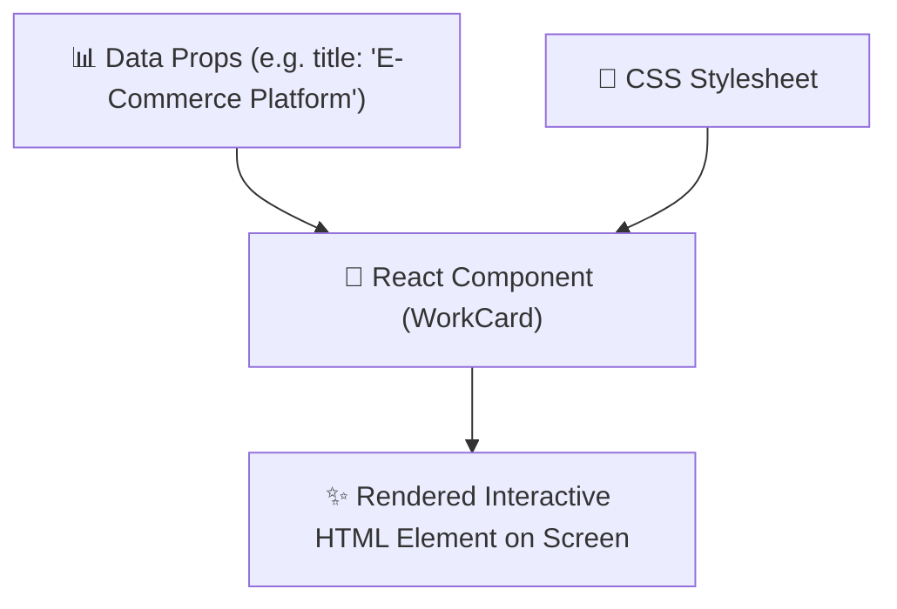
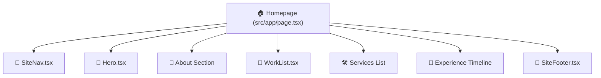
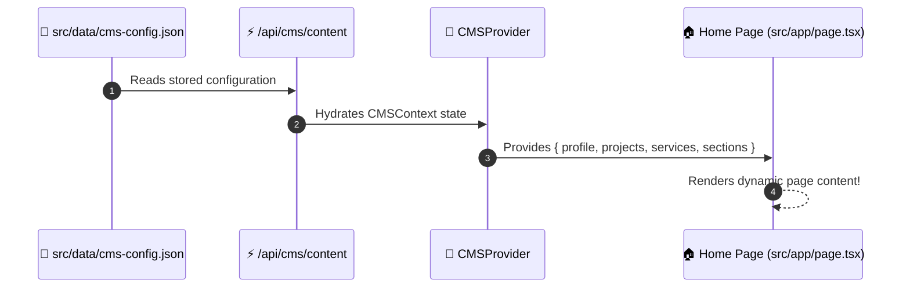

# 🧩 Chapter 4: Components & Pages Guide

In this chapter, we will break down how React components work in this project, how page routes render content, and how you can add new text or sections!

---

## 🧩 1. What is a React Component?

A React Component is a JavaScript function that returns HTML-like code called **JSX** (JavaScript XML).



Here is a simplified example:

```tsx
// Example React Component
export function ProjectBadge(props: { text: string }) {
  return (
    <span className="project-badge">
      🌟 {props.text}
    </span>
  );
}
```

> [!NOTE]
> The curly braces `{props.text}` allow us to inject dynamic JavaScript variables directly into the HTML!

---

## 🏗️ 2. Key Components Building the Website



### 🌟 `Hero.tsx` ([src/components/Hero.tsx](file:///c:/Users/Admin/OneDrive/Desktop/Hluga%27s%20site/src/components/Hero.tsx))
- **Role**: High-impact banner on the homepage.
- **Cool Feature**: Uses an HTML5 `<canvas>` element and mouse event listeners to render a spotlight flashlight mask that follows your cursor in real time!

### 🧭 `SiteNav.tsx` ([src/components/SiteNav.tsx](file:///c:/Users/Admin/OneDrive/Desktop/Hluga%27s%20site/src/components/SiteNav.tsx))
- **Role**: Floating header navigation bar and mobile drawer menu.
- **Features**: Contains links to `/`, `/work`, `/services`, `/about`, `/experience`, `/contact`, and a link to `/cms`.

### 💼 `WorkList.tsx` ([src/components/WorkList.tsx](file:///c:/Users/Admin/OneDrive/Desktop/Hluga%27s%20site/src/components/WorkList.tsx))
- **Role**: Renders case study cards displaying project title, stack tags, problem/solution summaries, and performance metrics.

---

## 🌐 3. How Next.js App Router Works (`src/app/`)

Next.js turns folder names inside `src/app/` into public URLs on your website:

```
src/app/
├── 🏠 page.tsx               --->  https://yoursite.com/
├── 💼 work/
│   ├── page.tsx            --->  https://yoursite.com/work
│   └── [slug]/page.tsx     --->  https://yoursite.com/work/e-commerce-platform
├── 👤 about/page.tsx         --->  https://yoursite.com/about
├── 🛠️ services/page.tsx      --->  https://yoursite.com/services
├── 📅 experience/page.tsx    --->  https://yoursite.com/experience
├── 📬 contact/page.tsx       --->  https://yoursite.com/contact
└── 🎛️ cms/page.tsx           --->  https://yoursite.com/cms
```

---

## 🔄 4. How Data Flows to Pages

Instead of hardcoding text in static files, pages consume live data from **`useCMS()`** context:



> [!IMPORTANT]
> Because pages get data from `useCMS()`, whenever you edit text or toggle sections in the CMS, your website updates **instantly** without needing code edits!

---

> [!TIP]
> **Ready for Chapter 5?**  
> Jump to **[Chapter 5: The CMS Platform & Analytics](file:///c:/Users/Admin/OneDrive/Desktop/Hluga%27s%20site/to%20learn/05-the-cms-platform-and-analytics.md)** to explore the production backend engine!
