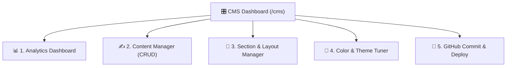
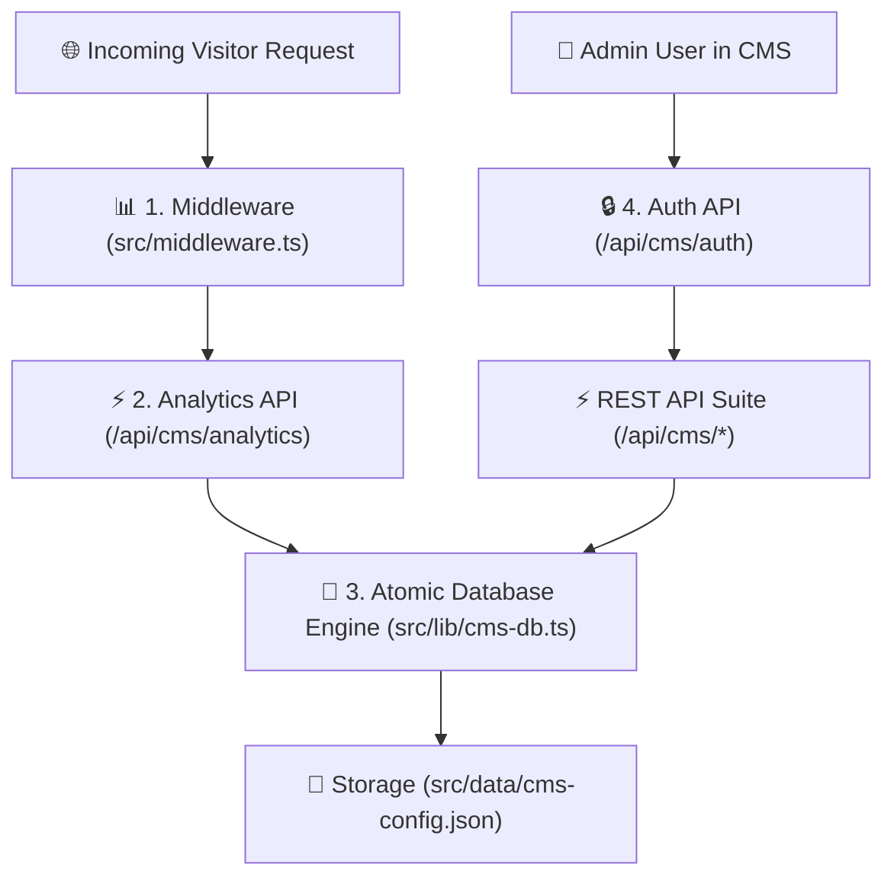
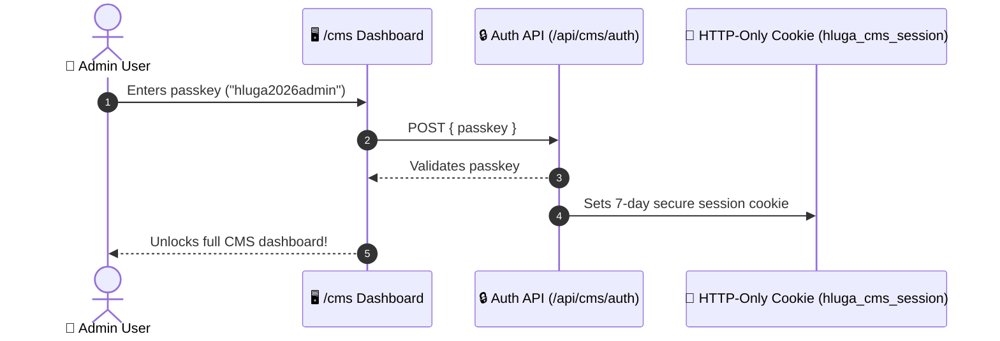

# 🎛️ Chapter 5: The CMS Platform & Real-Time Analytics

In this chapter, you will learn how the CMS platform (`CMS/`) and the production backend architecture work under the hood.

---

## 🎛️ 1. What is the CMS Platform?

The **CMS (Content Management System)** is an admin platform built into your website at `/cms`. It gives you full control over your site without editing code:



---

## ⚡ 2. Backend Suite Architecture

The backend consists of four key modules:



---

## 📊 3. Real-Time Analytics System

### How Traffic Tracking Works:
1. When a visitor views any page (like `/work`), **`src/middleware.ts`** intercepts the request automatically.
2. It extracts:
   - **Path**: `/work`
   - **Referrer**: Identifies Direct, Google Search, LinkedIn, GitHub, or Social Media
   - **Device**: Detects Mobile phone, Desktop, or Tablet
   - **IP Hash**: Calculates unique active sessions
3. It sends this data to `/api/cms/analytics`, which updates the database automatically!

```
+---------------------------------------------------------------------------------------+
|                                REAL-TIME ANALYTICS METRICS                            |
+--------------------------+---------------------------+--------------------------------+
|  👁️ Total Page Views     |  👥 Unique Visitors       |  ⏱️ Avg. Session Duration     |
|  Total hit counter across |  Individual active        |  Average engagement time      |
|  all portfolio routes    |  sessions                 |  spent exploring               |
+--------------------------+---------------------------+--------------------------------+
```

---

## 🔒 4. Security & Admin Authentication Gate

The CMS dashboard is protected by an admin authentication gate:



> [!IMPORTANT]
> **Default Admin Key**: `hluga2026admin`  
> You can change this key at any time by setting the `CMS_ADMIN_KEY` environment variable!

---

> [!TIP]
> **Ready for Chapter 6?**  
> Jump to **[Chapter 6: Customization & Editing Guide](file:///c:/Users/Admin/OneDrive/Desktop/Hluga%27s%20site/to%20learn/06-customization-and-editing-guide.md)** for a practical step-by-step editing cookbook!
