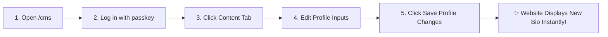
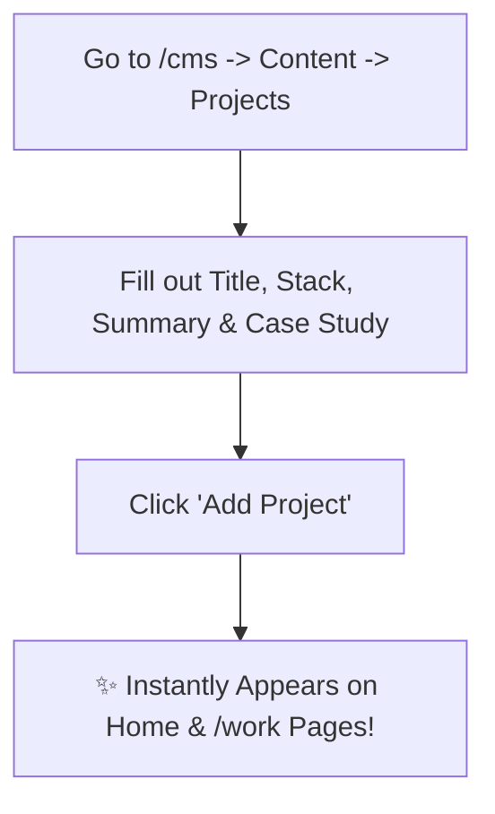
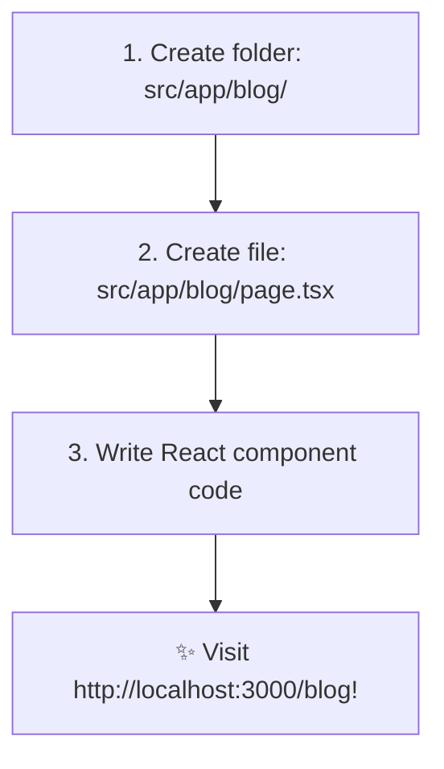

# 🛠️ Chapter 6: Practical Customization & Editing Guide

This chapter is a practical "How-To" cookbook. It contains exact step-by-step instructions for modifying every part of the website, whether using the CMS dashboard or by editing code directly!

---

## 👤 1. How to Change Your Bio, Name, or Email



### Method A: Using the CMS (No Code Required)
1. Open your browser and navigate to `http://localhost:3000/cms` (or `https://yoursite.com/cms`).
2. Log in using your passkey (default: `hluga2026admin`).
3. Click the **Content** tab at the top.
4. Under **Profile & Bio**, edit:
   - **Full Name**: e.g., Lehlohonolo Mofokeng
   - **Brand Title**: e.g., HLUGA.
   - **Developer Role**: e.g., Junior Frontend Developer
   - **Location**: e.g., Johannesburg, ZA
   - **Email Address**: e.g., hello@nexlinksolutionsza.co.za
5. Click **Save Profile Changes**. Your website will immediately display your new details!

### Method B: Editing Code Directly
1. Open **[src/data/cms-config.json](file:///c:/Users/Admin/OneDrive/Desktop/Hluga%27s%20site/src/data/cms-config.json)**.
2. Edit the `"profile"` object:
   ```json
   "profile": {
     "name": "Lehlohonolo Mofokeng",
     "brand": "HLUGA.",
     "role": "Junior Frontend Developer",
     "location": "Johannesburg, ZA"
   }
   ```

---

## 💼 2. How to Add a New Portfolio Project



### Using the CMS:
1. Go to `/cms` → Click **Content** → Select **Projects**.
2. Fill out the **Add New Project** form:
   - **Project Title**: e.g., *"Mobile Banking App"*
   - **Role / Category**: e.g., *"React Native & TypeScript"*
   - **Client**: e.g., *"Fintech Client, Sandton"*
   - **Year**: e.g., *"2026"*
   - **Summary**: Brief overview of the project
   - **Problem / Approach / Outcome**: Detailed case study breakdown
3. Click **Add Project**.

---

## 📑 3. How to Hide or Reorder Homepage Sections

```
+-------------------------------------------------------------------------------+
|                            SECTION MANAGER CONTROLS                           |
+-------------------------------------------------------------------------------+
|  [#1] Hero Section        (Active  🟢)   [↑] [↓]   [Toggle Switch ON/OFF]     |
|  [#2] About Me            (Active  🟢)   [↑] [↓]   [Toggle Switch ON/OFF]     |
|  [#3] Selected Work       (Hidden  🔴)   [↑] [↓]   [Toggle Switch ON/OFF]     |
+-------------------------------------------------------------------------------+
```

1. Go to `/cms` → Click **Sections**.
2. **Hide a Section**: Toggle the switch next to the section name to **OFF**.
3. **Reorder Sections**: Click the **Up (↑)** or **Down (↓)** arrow buttons.
4. **Change Headings**: Edit the **Main Heading Title** box.
5. Click **Save Section Layout**.

---

## 🎨 4. How to Change Website Colors

1. Go to `/cms` → Click **Colors & Theme**.
2. **Option 1**: Click one of the preset theme buttons (*Cyber Cyan*, *Sandton Gold*, *Midnight Emerald*, *Obsidian Violet*).
3. **Option 2**: Use the color picker to pick your own custom **Primary Accent Color** (`--hl-accent`).
4. Watch the **Live Site Preview** pane on the right side of the screen to test your design!

---

## ➕ 5. How to Add a Brand New Page to the Website

Suppose you want to add a new page at `https://yoursite.com/blog`:



1. Open your code editor and create a new folder: `src/app/blog/`.
2. Inside `src/app/blog/`, create a new file named `page.tsx`.
3. Paste the following starting code into `src/app/blog/page.tsx`:
   ```tsx
   "use client";

   export default function BlogPage() {
     return (
       <div style={{ padding: "8rem 2rem", maxWidth: "1200px", margin: "0 auto" }}>
         <h1>My Blog Page</h1>
         <p>Welcome to my new blog page!</p>
       </div>
     );
   }
   ```
4. Save the file. Navigating to `http://localhost:3000/blog` will now display your new page!

---

> [!TIP]
> **Ready for Chapter 7?**  
> Finish your learning journey by reading **[Chapter 7: Deployment & Git](file:///c:/Users/Admin/OneDrive/Desktop/Hluga%27s%20site/to%20learn/07-deployment-and-git.md)**!
