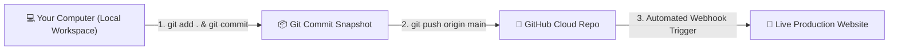
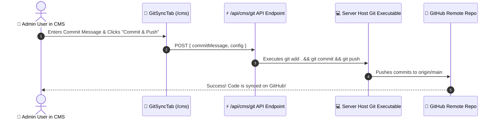

# 🚀 Chapter 7: Deployment & Git Workflow

In this final chapter, you will learn how version control with **Git** works, how your code is stored on **GitHub**, and how to host your website live on the internet!

---

## 🐙 1. What is Git & GitHub?



> [!NOTE]
> **Git**: A time machine for your codebase. It saves snapshots (called **commits**) so you can track changes and revert if anything breaks.  
> **GitHub**: A cloud platform hosting your repository online at:  
> **[https://github.com/HarryMofoka/Hluga-s-website-portfolio.git](https://github.com/HarryMofoka/Hluga-s-website-portfolio.git)**

---

## ⚡ 2. Essential Git Terminal Commands

```bash
# 1. Check which files have been modified
git status

# 2. Stage all modified files for a commit
git add .

# 3. Save a snapshot with a descriptive message
git commit -m "feat: add new project and update bio"

# 4. Push your commit snapshot to GitHub
git push origin main
```

---

## 🎛️ 3. One-Click CMS Git Deployment

You don't even need to open a terminal to push updates!



---

## 🌐 4. How to Deploy Your Website Live to Vercel (Free Hosting)

To make your website accessible to anyone in the world on a custom `.com` or `.vercel.app` domain:

```
+-------------------------------------------------------------------------------+
|                           VERCEL DEPLOYMENT STEPS                             |
+-------------------------------------------------------------------------------+
|  Step 1: Sign up at Vercel.com using your GitHub account                      |
|  Step 2: Click "Add New Project" -> Import "HarryMofoka/Hluga-s-website-portfolio" |
|  Step 3: Keep Framework as Next.js and click "Deploy"                         |
|  Step 4: Your site is LIVE worldwide in under 60 seconds! 🚀                   |
+-------------------------------------------------------------------------------+
```

> [!IMPORTANT]
> Whenever you push changes to GitHub (either via `git push` or by clicking **Commit & Push** in the CMS), Vercel automatically re-deploys your live website in seconds!

---

## 🎉 Congratulations!

You have completed the **HLUGA. Learning Book**! You now understand HTML/CSS basics, React components, Next.js routing, design tokens, the production CMS backend, real-time analytics, and cloud deployment.
